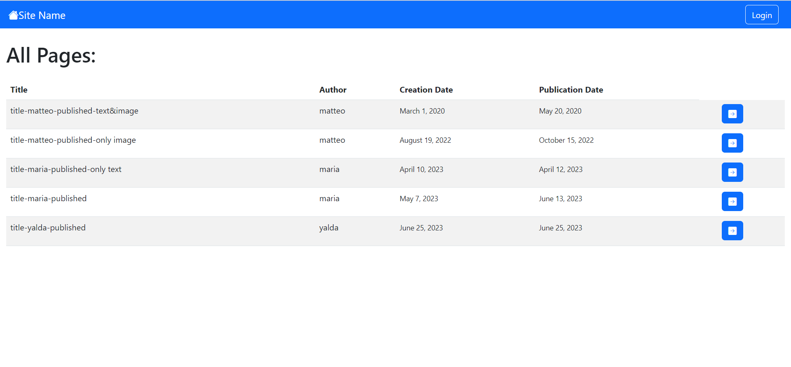
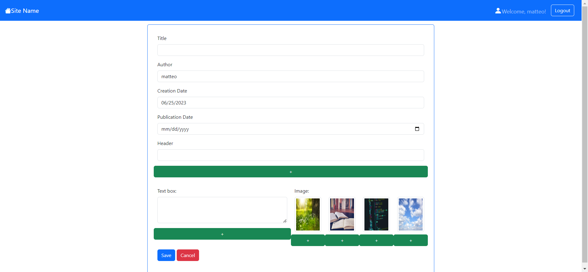

[](https://classroom.github.com/a/8AapHqUJ)

# Exam #1: "CMSmall"

## Student: s314700 MOBARGHA Yalda sadat

## React Client Application Routes

<!-- - Route `/`: page content and purpose
- Route `/something/:param`: page content and purpose, param specification -->
- Route `/`: home page, where everybody can see the list of all published pages.
- Route `index element`: it has no render of itself and it renders the parent route(`/`).
- Route `page/:filterId`:if the user is not logged in it will be redirected to login page, otherwise if the logged in user is an admin it will be redirected to admin page and if it is a normal user it will be directed to normal user back office.
- Route `add`: page where authenticated users can fill the required parameters of the form and create a new page. if the user is not authenticated it will be redirected to login page.
- Route `edit/:PageId`: page where authenticated users can change the contents of the page they have created before(admin can change page contents of all users). if the user is not authenticated it will be redirected to login page.
- Route `view/:PageId`: page where users view all the contents of the page including images, headers ...
- Route `*`: notfound page, in case of error.
- Route `/login`: login page where the users can enter email and password in order to log into their account.

## API Server

<!-- - put `/api/something`
  - request parameters and request body content
  - response body content
- GET `/api/something`
  - request parameters
  - response body content
- POST `/api/something`
  - request parameters and request body content
  - response body content -->

- GET `/api/pages`

  - Request parameters: empty
  - Description: Get a list of all published pages
  - Response: `200 OK` (success),or `500 Internal Server Error` (generic error).
  - Response body: a list of all pages in database
  ```json
    [
        {
            "user":4,
            "title": "title-maria-published",
            "Author": "maria",
            "Creation Date": "2023/05/07",
            "Publication Date": "2023-06-13"
        },
        ...
    ]
    ```


- GET `/api/pagesFilterPub`

  - Request parameters: empty
  - Description: Get a list of all the pages that this user created
  - Response: `200 OK` (success),or `500 Internal Server Error` (generic error).
  - Response body: a list of all pages with a publication date sooner than today from database
    ```json
    [
        {
            "user":4,
            "title": "title-maria-published",
            "Author": "maria",
            "Creation Date": "2023/05/07",
            "Publication Date": "2023-06-13"
        },
        ...
    ]
    ```
  
- GET `/api/pages/filter/:userId`
 
  - Request parameters: userId
  - Description: Get a list of all the pages that this user created
  - Response: `200 OK` (success),`404 Not Found` (not present or unavailable),or `500 Internal Server Error` (generic error).
  - Response body: a list of all pages authored by this userId
  ```json
    [
        {
            "user":1,
            "title": "title-matteo-draft",
            "Author": "matteo",
            "Creation Date": "2023/06/25",
            "Publication Date": ""
        },
        ...
    ]
    ```

- GET `/api/pages/filter_other/:userId`

  - Request parameters: userId
  - Description: Get a list of all the pages written by other users
  - Response: `200 OK` (success),`404 Not Found` (not present or unavailable),or `500 Internal Server Error` (generic error).
  - Response body: a list of all pages not authored by this userId
  ```json
    [
        {
            "user":4,
            "title": "title-maria-published",
            "Author": "maria",
            "Creation Date": "2023/05/07",
            "Publication Date": "2023-06-13"
        },
        {
            "user":2,
            "title": "title-yalda-published",
            "Author": "yalda",
            "Creation Date": "2023/06/25",
            "Publication Date": "2023/06/25"
        },
        ...
    ]
    ```

- GET `/api/pages/:id`

  - Request parameters: id
  - Description: Get the full content of a page based on it's pageid=id
  - Response: `200 OK` (success),`404 Not Found` (not present or unavailable),or `500 Internal Server Error` (generic error).
  - Response body: the content of a specific page based on it's pageid=id
  ```json
    [
        {
            "user":4,
            "title": "title-maria-published",
            "Author": "maria",
            "Creation Date": "2023/05/07",
            "Publication Date": "2023-06-13",
            "blocks":[{"value":"text","type":1}...]
        }
    ]```

- GET `/api/authors`

  - Request parameters: empty
  - Description: Get a list of all users that can create a page(users available in the database)
  - Response: `200 OK` (success),or `500 Internal Server Error` (generic error).
  - Response body: a list of all users registered on website
 
- GET `/api/siteName`

  - Request parameters: empty
  - Description: Get the name of the website
  - Response: `200 OK` (success),or `500 Internal Server Error` (generic error).
  - Response body: a json file containing only website name

- PUT `/api/pages/:id`
    - Request parameters: empty
    - Description: Update a page identified by pageid.
    - Request body: json object containing page information and id
    ```json
        [
            {
                "id":9,
                "user":4,
                "title":"title-maria-published",
                "Author": "maria",
                "Creation Date": "2023/05/07",
                "Publication Date": "",
                "blocks":[{"value":"text","type":1}...]
            }
        ]
    ``` 
    - Response: `200 OK` (success),`404 Not Found` (wrong id),`422 Unprocessable Entity` (validation error in case of not valid request body), `503 Service Unavailable` (generic error).
    - Response body: empty

- PUT `/api/updatesitename`

    - Description: Update the name of the website.
    - Request body: json file containing page name 
    - Response: `200 OK` (success),or `500 Internal Server Error` (generic error).
    - Response body: empty

- POST `/api/pages`

    - Request parameters: empty
    - Description: add a new page.
    - Request body: json file containing page information
        ```json
        [
            {
                "user":4,
                "title": "title-maria-published",
                "Author": "maria",
                "Creation Date": "2023/05/07",
                "Publication Date": "",
                "blocks":[{"value":"text","type":1}...]
            }
        ]
    ``` 
    - Response: `200 OK` (success),`422 Unprocessable Entity` (validation error in case of not valid request body), `503 Service Unavailable` (generic error).
    - Response body: empty

- DELETE `/api/pages/:id`
  - Description: Delete an existing page
  - Request body: empty
  - Response: `200 OK` (success), `503 Service Unavailable` (generic error).
  - Response body: an empty object

- POST `/api/sessions`
  - Description: authenticate the user who is trying to login
  - Request body: credentials of the user who is trying to login
    ``` JSON
    {
        "email": "lorenzo@gmail.com",
        "password": "lorenzops"
    }
    ```
  - Response: `200 OK` (success), `401 Unauthorized User` (login failed),`500 Internal Server Error` (generic error).
  - Response body: authenticated user
    ``` JSON
    {
        "id": 3,
        "email": "lorenzo@gmail.com",
        "name": "lorenzo",
        "admin": 0
    }
    ```

- GET `/api/sessions/current`
  - Description: check if current user is logged in and get the users' data 
  - Request body: empty
  - Response: `200 OK` (success), `401 Unauthorized User` (login failed), `500 Internal Server Error` (generic error).
  - Response body: authenticated user
    ``` JSON
    {
        "id": 3,
        "email": "lorenzo@gmail.com",
        "name": "lorenzo",
        "admin": 0
    }
    ```

- DELETE `/api/sessions/current`
  - Description: logout current user
  - Request body: empty
  - Response: `200 OK` (success), `401 Unauthorized User` (login failed),`500 Internal Server Error` (generic error).
  - Response body: none


## Database Tables

- Table `Pages` - contains: pageid, user id, title, author, creation_date, publication_date
- Table `Blocks` - contains: id, pageid, block_order, value, type(header, text or image)
- Table `users` - contains: userid, email, name, hash, salt, admin
- Table `base_info` - contains id, siteName

## Main React Components

<!-- - `ListOfSomething` (in `List.js`): component purpose and main functionality
- `GreatButton` (in `GreatButton.js`): component purpose and main functionality -->
- `LoginForm` (in `Auth.jsx`): makes input filds for user to enter login information.
- `LogoutButton` (in `Auth.jsx`): controls logout functionality of the website.
- `LoginButton` (in `Auth.jsx`): controls login functionality of the website and check the users' information.
- `Navigation` (in `Navigation.jsx`): makes the navigation bar and controls all its functionalities.
- `PageForm` (in `PageForm.jsx`): generally shows information inside a page based on the purpose of the page it can have edit, move, add, delete, save or cancel buttons. other than showing page contents it is used also for editing a page or adding different blocks of content to the page.
- `PageTable`    (in `PageLibrary.jsx`): makes a table for showing pages with each row show a page row component.
- `PageRow`    (in `PageLibrary.jsx`): makes a row for page table, each row shows different information about the page like title or author and in case of appearing inside different pages it can have edit, delete or view buttons.
- `DefaultLayout` (in `WebPageLayout.jsx`): makes a page with navbar on top of it and puts other contents under the navbar.
- `AddLayout` (in `WebPageLayout.jsx`): makes a web page for adding a new page to the database.
- `ViewLayout` (in `WebPageLayout.jsx`): makes a web page for showing contents of each page without possibility of edit.
- `EditLayout` (in `WebPageLayout.jsx`): makes a web page for editing contents inside a page.
- `NotFoundLayout` (in `WebPageLayout.jsx`): makes a web page for the times that you are at the wrong route.
- `FrontOfficeLayout` (in `WebPageLayout.jsx`): makes a web page with a table that shows all of the published pages with possibility of viewing. 
- `BackOfficeLayout` (in `WebPageLayout.jsx`): makes a web page with two tables, one for editing and deleting authored pages,the other for showing pages of other authers with an add button to add new pages.
- `AdminLayout` (in `WebPageLayout.jsx`): makes a web page with a table of all the existing pages with the possibility to edit or delete and an add button to add a new page, also a section to change the name of the website.
- `LoadingLayout` (in `WebPageLayout.jsx`): makes a empty page for loading times.
- `LoginLayout` (in `WebPageLayout.jsx`): makes a web page for getting information to login.


## Screenshot




## Users Credentials

|       email         |   name  | password  |admin|
|---------------------|---------|-----------|-----|
| matteo@polito.it    | matteo  | matteops  | no  |
| yalda@gmail.com     | yalda   | yaldaps   | yes |
| lorenzo@gmail.com   | lorenzo | lorenzops | no  |
| maria@polito.it     | maria   | mariaps   | no  |